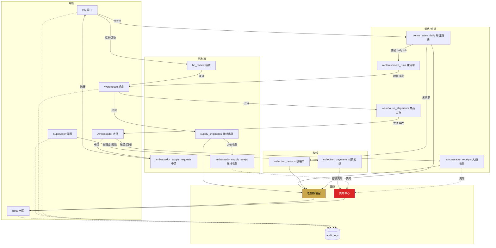

# W Cigar Platform — 大使/酒店銷售/補貨/耗材/收帳/戰情室/異常中心 Proposal

> 環境狀態：Linux 沙箱不可用，本輪**只產出 proposal**，不觸碰 production DB、不 push、不部署、不建骨架檔。等你書面確認 proposal 再下一輪建檔。
>
> 日期：2026-04-25　版本：v0.1-draft

---

## 1. 我已掃描到的現有結構

### 1.1 Tech stack（package.json）
React 18.3.1 / React Router 6.26.0 / Supabase JS 2.45.0 / date-fns 3.6.0 / lucide-react 0.441.0 / Vite（無 vercel.json，靠 Vercel 預設）。

### 1.2 三層子系統
- **員工系統**（role `boss` | `staff`，走 `employees` 表 + `w_cigar_user` localStorage）
- **大使系統** `/ambassador/*`（獨立 auth，`amb_user` localStorage，目前有 `AmbassadorPunch.jsx`）
- **POS** `/pos-app/*`（12h session，獨立）
- **VIP Cellar** `/vip-cellar/*`（自帶 auth，vip_* 表）

### 1.3 現有資料表（從 `.from()` / `.rpc()` 抓到）
`employees / schedules / task_status / abnormal_reports / punch_records / shift_handover / notices / inventory_master / inventory_records / leave_requests / daily_revenue / cleaning_status / monthly_commission / staff_monthly_commission / commission_rate_rules / audit_logs / vip_cabinets / vip_orders / vip_order_items / vip_withdrawals / vip_payments`

RPC：`get_dealer_pending_orders / get_vip_dashboard / ambassador_get_home / ambassador_punch / calc_monthly_commission / sync_commission_to_payroll`

### 1.4 黑金風格
定義在 `src/styles/global.css`。主色：`#0a0a0a / #c9a84c / #e8e0d0 / #2a2520`。已有 `.card / .btn-gold / .btn-outline / .badge-* / .loading-shimmer`。響應式 phone / iPad / desktop 三層齊全。

### 1.5 風險雷達
- 沒看到 `vercel.json`（預設即可，但新增 `/ambassador/supplies` 等子路由要確認 SPA rewrite 有效）
- `Payroll.jsx` PIN `'1986'` 硬編碼（與本案無關，順手提醒）
- 沒有 RLS 痕跡，目前大概是 publishable key + 權限放寬，**本案新模組我會預留 RLS 草案但不預設啟用**
- 沒看到統一 Supabase hook，重複查詢模式（本案會建 `src/lib/hooks/` 聚合）

---

## 2. 可沿用模組

| 既有資產 | 沿用方式 |
|---|---|
| `src/lib/auth.jsx` | 擴充 `role` enum，加 `warehouse / supervisor`（大使繼續走 amb_user 獨立流） |
| `src/lib/supabase.js` | 原 client 繼續用，不改 |
| `src/lib/audit.js` | 所有新模組的審核動作統一寫入 `audit_logs` |
| `abnormal_reports` 表 | 考慮**沿用**，不新建 `exception_events`，用 `category` 欄位擴充（風險較低） |
| `inventory_master / inventory_records` | 作為總倉主庫存的 source of truth，新模組讀這張 |
| `global.css` 黑金規範 | 全部新頁照用，不另做 tokens |
| `components/AmbassadorLayout.jsx` | 大使側路由一律包在這，統一 bottom nav |
| `components/ErrorBoundary.jsx` | 新路由包一層 |

---

## 3. 新增模組規劃（模組 A~K → 路由 + 檔案對應）

| 模組 | 新頁面 | 檔案位置 |
|---|---|---|
| A. HQ 酒店銷售 Key-in | `/admin/venue-sales`、`/admin/venue-sales/new` | `src/pages/admin/VenueSales*.jsx` |
| B. 自動補貨引擎 | （RPC 產生，無獨立頁） | `src/lib/services/replenishment.js` |
| C. 當日補貨表 / PDF | `/admin/replenishment`、`/admin/replenishment/:id` | `src/pages/admin/Replenishment*.jsx` |
| D. 總倉撿貨出貨 | `/warehouse/pick-lists`、`/warehouse/shipments/:id` | `src/pages/warehouse/*` |
| E. 大使收貨確認 | `/ambassador/receipts`、`/ambassador/receipts/:id` | `src/pages/ambassador/Receipts*.jsx` |
| F. 大使耗材申請 | `/ambassador/supplies`、`/ambassador/supplies/new`、`/ambassador/supplies/:id`、`/ambassador/supply-receipts` | `src/pages/ambassador/Supply*.jsx` |
| G. HQ 耗材審核 | `/admin/supply-requests`、`/admin/supply-requests/:id` | `src/pages/admin/SupplyReview*.jsx` |
| H. 總倉耗材出貨 | `/warehouse/supply-pick-lists`、`/warehouse/supply-shipments` | `src/pages/warehouse/Supply*.jsx` |
| I. 督導收帳 | `/admin/collections`（督導 + HQ 共用，視 role 遮欄位） | `src/pages/admin/Collections.jsx` |
| J. 老闆戰情室 | `/boss/war-room` | `src/pages/boss/WarRoom.jsx` |
| K. 異常中心 | `/admin/exceptions` | `src/pages/admin/Exceptions.jsx` |

**不做**：`/ambassador/attendance`、`/ambassador/punch` 任何新頁。**現有 `AmbassadorPunch.jsx` 與 `punch_records` 表**本案不刪除（風險高），改為：
1. 從 `AmbassadorApp.jsx` 的 route map 拿掉 `/ambassador/punch`
2. 從大使 bottom nav 移除打卡入口
3. 在檔案頂部加 `// DEPRECATED 2026-04-25: 大使取消打卡，保留檔案避免 git history 爆炸`
4. 等下一次清理週期再物理刪除

### 潛在衝突
- `punch_records` 表被 `StaffHome / PunchHistory` 等員工頁使用（內場員工仍打卡），**不可刪表**
- `inventory_master` 原本是店內庫存，要新增 `location_type` 欄位或改用 `venue_inventory` 獨立表（推薦後者，避免污染既有資料）
- `abnormal_reports` 既有結構可能無 `category` 或 `source_type` 欄位，需 ALTER 加欄位才能沿用；若改動風險太高，改走新表 `exception_events`（見 Phase 4）

---

## 4. 角色權限設計

| 角色 | 辨識方式 | 看 | 改 | 禁止 |
|---|---|---|---|---|
| **Boss / Admin** | `employees.is_admin = true` → role='boss' | 全部 | 可覆核、解除異常、看 audit log | 無 |
| **HQ / Staff** | `employees.is_admin = false` + 無 warehouse/supervisor 標記 → role='staff' | 銷售、補貨、耗材、異常 | key-in 銷售、審核耗材、處理異常 | 無紀錄修改歷史資料 |
| **Warehouse / 總倉** | `employees.role_ext = 'warehouse'`（新欄位） | 補貨單、耗材待出貨 | 撿貨、出貨、建立 shipment | 審核耗材、改銷售 |
| **Supervisor / 督導** | `employees.role_ext = 'supervisor'` + `supervisor_venue_scope` | 自己負責酒店收帳 | 登現金/匯款/部分收款、回報差額 | 改商品銷售明細 |
| **Ambassador / 大使** | `ambassadors` 表（獨立 auth） | 自己業績/排行/場域 | 確認收貨、回報錯誤、申請耗材 | 打卡、改價、改庫存、新增銷售、看他人資料 |

**實作方式**：
- 現有 `employees.is_admin` 繼續用
- 新加 `employees.role_ext TEXT NULL CHECK (role_ext IN ('warehouse','supervisor'))`
- `src/lib/auth.jsx` 的 `user.role` 計算邏輯：
  ```
  is_admin=true         → 'boss'
  role_ext='warehouse'  → 'warehouse'
  role_ext='supervisor' → 'supervisor'
  else                  → 'staff'
  ```
- 大使維持現有 `amb_user` 獨立 context

---

## 5. 資料表 Proposal（Phase 4）

> **原則**：全部用 `wc_` prefix 避免與既有表混淆；每張表 `created_at / updated_at / created_by`；audit 動作寫 `audit_logs`（沿用既有表）。所有表**預設 RLS OFF**，先上線後再啟用。

### 5.1 核心資料
#### `ambassadors`（新）
| 欄位 | 型別 | 說明 |
|---|---|---|
| id | uuid PK | |
| name | text NOT NULL | |
| phone | text | 登入用 |
| login_code | text | PIN / 登入碼 |
| supervisor_id | uuid FK→employees | 所屬督導 |
| is_active | bool default true | |
| hired_at | date | |
| created_at/updated_at | timestamptz | |

index：`(phone)`, `(supervisor_id)`, `(is_active)`
audit：新增、停用寫 audit_logs

#### `venues`（新）
| 欄位 | 型別 | 說明 |
|---|---|---|
| id | uuid PK | |
| name | text | 酒店 / 場域名稱 |
| type | text CHECK IN ('hotel','bar','lounge','other') | |
| address | text | |
| contact_name / contact_phone | text | |
| supervisor_id | uuid FK→employees | |
| is_active | bool | |

#### `ambassador_assignments`（新）
大使 ↔ 場域 多對多。
| 欄位 | 型別 |
|---|---|
| id | uuid PK |
| ambassador_id | uuid FK |
| venue_id | uuid FK |
| assigned_at / released_at | timestamptz |

UNIQUE `(ambassador_id, venue_id, released_at IS NULL)` partial index

### 5.2 銷售
#### `venue_sales_daily`（新）
HQ 每日 key-in 的總單。
| 欄位 | 型別 |
|---|---|
| id | uuid PK |
| sale_date | date NOT NULL |
| venue_id | uuid FK |
| ambassador_id | uuid FK NULL |
| total_amount | numeric |
| cash_amount / transfer_amount / monthly_amount / unpaid_amount | numeric |
| payment_status | text CHECK IN ('paid','partial','unpaid','monthly') |
| note | text |
| created_by | uuid FK→employees |

index：`(sale_date)`, `(venue_id, sale_date)`, `(ambassador_id, sale_date)`

#### `venue_sales_items`（新）
明細。
| 欄位 | 型別 |
|---|---|
| id | uuid PK |
| sale_id | uuid FK→venue_sales_daily ON DELETE CASCADE |
| product_id | uuid FK→inventory_master |
| quantity | int |
| unit_price | numeric |
| subtotal | numeric GENERATED |

### 5.3 庫存（場域端）
#### `venue_inventory`（新）
每個場域每個品項的即時庫存。
| 欄位 | 型別 |
|---|---|
| id | uuid PK |
| venue_id | uuid FK |
| product_id | uuid FK |
| on_hand | int default 0 |
| safety_stock | int default 0 |
| last_updated | timestamptz |

UNIQUE (venue_id, product_id)

#### `venue_inventory_ledger`（新）
流水帳，支援 trigger 自動從 sales / shipment / receipt 扣減與累加。
`change_type`: `sale / shipment_in / discrepancy_adj / manual_adj`

### 5.4 補貨
#### `replenishment_runs`（新）
| run_date / status ('draft','confirmed','picking','shipped','closed') |

#### `replenishment_items`（新）
| run_id FK / venue_id / product_id / sold_qty / suggested_qty / actual_shipped_qty / status |

### 5.5 總倉出貨（商品）
#### `warehouse_shipments`（新）
| shipment_no（trigger 產 `WS-YYMMDD-####`）/ run_id / status / picked_by / shipped_at |

#### `warehouse_shipment_items`（新）
| shipment_id / product_id / qty / note |

### 5.6 大使收貨
#### `ambassador_receipts`（新）
| shipment_id / ambassador_id / venue_id / status ('pending','confirmed','discrepancy') / confirmed_at |

#### `ambassador_receipt_discrepancies`（新）
| receipt_id / product_id / issue_type ('qty_mismatch','wrong_item','damaged','not_received') / reported_qty / note |

### 5.7 督導收帳
#### `collection_records`（新）
| sale_id FK→venue_sales_daily / supervisor_id / due_amount / collected_amount / status ('pending','partial','collected','exception') |

#### `collection_payments`（新）
| collection_id / method ('cash','transfer','monthly') / amount / paid_at / proof_url |

### 5.8 耗材
#### `supply_items`（新）
固定 9 類 + 自由填。
| id / name / category ('cedar','humidity_pack','zip_bag','gas','flat_cutter','v_cutter','drill','pin','other') / unit |

初始化 INSERT 9 筆。

#### `ambassador_supply_requests`（新）
| ambassador_id / venue_id / request_date / urgency ('normal','urgent') / status（10 狀態 enum）/ reason / note / reviewed_by / reviewed_at / rejection_reason |

status 對應你列的：`draft / submitted / approved / adjusted_approved / rejected / picking / shipped / received / discrepancy / closed`

#### `ambassador_supply_request_items`（新）
| request_id / supply_item_id / custom_name（當 category='other'）/ requested_qty / approved_qty / shipped_qty / received_qty |

#### `supply_shipments / supply_shipment_items`（新）
結構類比商品出貨。

#### `supply_receipt_discrepancies`（新）
類比商品收貨異常。

#### `supply_inventory_ledger`（新）
耗材流水帳（如果要追蹤場域耗材庫存）。

### 5.9 稽核
**沿用 `audit_logs`**，不新建。所有審核動作統一寫入 `entity_type / entity_id / action / actor_id / before / after`。

### 5.10 View（戰情室 / 排行）
- `vw_boss_war_room_daily`（JOIN venue_sales_daily + collection_records）
- `vw_product_sales_ranking`
- `vw_ambassador_ranking`
- `vw_venue_sales_ranking`
- `vw_supply_dashboard`
- `vw_supply_usage_ranking`
- `vw_supply_exception`

View 全部用 SECURITY INVOKER，不加 DEFINER（避免跨 role 資料外洩）。

### 5.11 待你確認
- 要沿用 `abnormal_reports` 加欄位，還是新建 `exception_events`？（我建議**新建**，原表給內場用，新表給供應鏈用，各自獨立好維護）
- `supply_inventory_ledger` 要不要做？（MVP 可以省，Phase 2 再做；但總倉耗材庫存你要不要追？）
- 大使 `login_code` 要 bcrypt 還是明碼？現有員工是明碼 PIN 對比，為了一致預設**明碼 PIN**，但建議 Phase 2 升級成 hash

---

## 6. RPC / View Proposal（Phase 5）

### MVP 必要（🔴）

| RPC | 權限 | Input | Output |
|---|---|---|---|
| `hq_submit_venue_sales` 🔴 | staff+ | sale_date, venue_id, ambassador_id, items[], payment_* | sale_id |
| `generate_daily_replenishment` 🔴 | staff+ | run_date | run_id + items count |
| `warehouse_confirm_pick` 🔴 | warehouse | run_id, picked_items[] | shipment_id |
| `warehouse_ship_replenishment` 🔴 | warehouse | shipment_id | shipped_at |
| `ambassador_get_pending_receipts` 🔴 | ambassador | (me) | list |
| `ambassador_confirm_receipt` 🔴 | ambassador | receipt_id | ok |
| `ambassador_report_receipt_error` 🔴 | ambassador | receipt_id, discrepancies[] | exception_id |
| `ambassador_submit_supply_request` 🔴 | ambassador | items[], urgency, reason | request_id |
| `ambassador_get_my_supply_requests` 🔴 | ambassador | filter | list |
| `hq_get_supply_requests` 🔴 | staff+ | filter | list |
| `hq_review_supply_request` 🔴 | staff+ | request_id, decision, item_overrides? | ok |
| `warehouse_get_supply_pick_list` 🔴 | warehouse | — | list |
| `warehouse_ship_supply_request` 🔴 | warehouse | request_id, shipped_items[] | shipment_id |
| `ambassador_confirm_supply_receipt` 🔴 | ambassador | shipment_id | ok |
| `supervisor_submit_collection` 🔴 | supervisor+ | sale_id, method, amount | ok |
| `get_boss_war_room_daily` 🔴 | boss | date | JSON |

### Phase 2（🟡）
`hq_resolve_supply_discrepancy / supervisor_get_collection_status / get_product_sales_ranking / get_ambassador_ranking / get_venue_sales_ranking / get_supply_dashboard / ambassador_report_supply_discrepancy`

### 權限實作
RPC 頂部用 `auth.uid()` 查 `employees` / `ambassadors`，不符合 role 直接 `RAISE EXCEPTION`。  
**缺點**：目前登入是 client-side localStorage，`auth.uid()` 為空。**解法兩條路**：
1. **短期**：RPC 不檢查 role，由前端 route guard 擋（風險：懂技術的大使可以直接打 Supabase REST）
2. **正確做法**：遷到 Supabase Auth，每個角色發 JWT（工作量大，Phase 2 做）

→ **Proposal 建議**：MVP 照短期走，前端 guard + 敏感 RPC 加 `IF EXISTS (SELECT 1 FROM employees WHERE ...)` 防線；Phase 2 整體升級到 Supabase Auth。

---

## 7. 前端路由 Proposal（Phase 6）

```
/admin/venue-sales                     # HQ 銷售 key-in 列表
/admin/venue-sales/new                 # key-in 表單
/admin/replenishment                   # 補貨單列表
/admin/replenishment/:id               # 補貨單明細 / A4 列印
/admin/supply-requests                 # 耗材審核列表
/admin/supply-requests/:id             # 審核單個申請
/admin/collections                     # 督導收帳總覽（HQ + 督導共用）
/admin/exceptions                      # 異常中心

/warehouse/pick-lists                  # 待撿貨補貨單
/warehouse/shipments                   # 出貨列表
/warehouse/shipments/:id               # 單筆出貨單
/warehouse/supply-pick-lists           # 耗材待出貨
/warehouse/supply-shipments            # 耗材出貨列表

/ambassador/home                       # 大使首頁（業績/公告/待辦）
/ambassador/performance                # 自己業績
/ambassador/ranking                    # 排行榜
/ambassador/profile                    # 個人資料
/ambassador/receipts                   # 待收貨批次
/ambassador/receipts/:id               # 確認收貨
/ambassador/supplies                   # 我的耗材申請列表
/ambassador/supplies/new               # 新申請
/ambassador/supplies/:id               # 單筆申請詳情
/ambassador/supply-receipts            # 耗材收貨確認

/boss/war-room                         # 老闆戰情室（本案，和你已經做的 /command-center 不同路徑，避免衝突）
```

### 路由守衛
- 在 `src/App.jsx` 內 boss 區加 `boss / staff / warehouse / supervisor` 條件
- 大使區沿用 `AmbassadorApp.jsx` 的 `amb_user` 檢查

### 黑金風格
全部 reuse `.card / .btn-gold / .badge-*`，不做新 CSS 檔。

### data layer 抽離
```
src/lib/services/
  venueSales.js
  replenishment.js
  warehouse.js
  supplies.js
  collections.js
  warRoom.js
```
每個檔案 export pure functions，UI 頁面 import，不在 UI 裡直接呼叫 supabase。方便未來切 MSW mock / Playwright。

---

## 8. 已實作檔案清單

**本輪無任何實作**。只產出這份 proposal。

等你書面確認後，下一輪我會：
1. 建 feature branch `feat/ambassador-supply-chain`（需你本機 git 協助或我透過 Chrome 在 GitHub 建）
2. 先建 migration SQL 草稿（不 apply）
3. 再建前端骨架 10 個頁面（可 build，全部 mock data）
4. 提供 preview deploy URL

---

## 9. build / test 結果

**N/A**，本輪無程式碼變更。Linux 沙箱今天起不來，無法本機 build。下一輪若在 Chrome 走 GitHub Web UI commit，會用 Vercel preview branch build 當驗證。

---

## 10. 風險與待確認事項

🔴 = 阻塞決策，🟡 = 建議決策，🟢 = 訊息告知

- 🔴 **異常表策略**：沿用 `abnormal_reports` 加欄位？還是新建 `exception_events`？
- 🔴 **Ambassador 登入**：MVP 維持 `amb_user` localStorage 明碼 PIN？還是現在就升級 Supabase Auth？
- 🔴 **場域庫存追不追**：`venue_inventory_ledger` 要做嗎？
- 🔴 **Supervisor 身份來源**：從 `employees.role_ext` 加標記？還是另建 `supervisors` 表？
- 🟡 **耗材出貨是否合併**：同一批次可否跨大使/跨場域合併出貨？（你 H 模組有提到，但要確認實務動線）
- 🟡 **銷售 key-in 授權**：員工打錯要不要作廢還是 edit 流程？（會影響 `venue_sales_daily` 要不要加 `status='voided'`）
- 🟡 **PDF 匯出**：MVP 用 window.print 還是 jsPDF？
- 🟢 **既有 `AmbassadorPunch.jsx`**：保留檔案加 DEPRECATED comment，從 bottom nav 與 route 拿掉入口（不實體刪除，避免影響 git history）
- 🟢 **既有 `/command-center`**：你上一版 HubHome 提的 `/command-center` 路徑與本案 `/boss/war-room` **不衝突**，我建議保留兩個：前者偏「即時 4 通路監控」，後者偏「昨日營運戰情」

---

## 11. 是否需要 DB migration 確認

**是**。所有新表 / 欄位都要 migration，請先看過 Phase 5 的 schema 再口頭批准，我才寫 `supabase/migrations/*.sql`。

**不動既有表**策略：除了 `employees.role_ext` 要新增一個 nullable column，其他既有表完全不改。

---

## 12. 是否需要 Supabase RLS 確認

**是**。MVP 階段預設所有新表 **RLS OFF**（跟現況一致），但我會在 migration 檔附 **RLS policy 草案註解**，你要打開時直接 uncomment 即可。請確認：
- MVP 是否先關 RLS（建議：是，降低卡關）
- Phase 2 升 Supabase Auth 時是否一併開 RLS（建議：是）

---

## 13. 是否有任何 production 風險

- **低**：所有新表、新路由、新 RPC，不動既有流程
- **中**：`employees.role_ext` ALTER TABLE ADD COLUMN — 需 migration，nullable 預設 null，不影響現有員工
- **低**：`AmbassadorPunch.jsx` 只從 nav + route 拿掉，檔案與 `punch_records` 表**不動**
- **零**：`w-cigar-dealer`（dealer.wcigarbar.com）本案完全不碰
- **零**：POS、VIP Cellar、內場員工打卡 全部不碰

---

## 14. 建議 commit message（下一輪用）

```
feat(ambassador): add supply-chain phase 1 scaffold — venue sales, replenishment, warehouse shipment, ambassador receipt, supply request/review, collection, war room, exception center

- 10 new routes (admin/warehouse/ambassador/boss scopes)
- 7 service modules in src/lib/services/
- migration drafts (not applied) for 18 new tables + 7 views
- RPC drafts (not applied) for 16 MVP functions
- reuses existing black-gold design tokens
- no changes to: employees flow, PunchRecords, POS, VIP Cellar, w-cigar-dealer
- ambassador punch removed from nav (file kept with DEPRECATED comment)
```

---

## 15. Mermaid 中文架構圖



---

## 附錄 A：下一輪我會做什麼（等你確認）

1. 建 migration SQL 草稿（路徑 `supabase/migrations/2026-04-25_ambassador_supply_chain.sql`）——**不 apply**
2. 建 RPC SQL 草稿（路徑 `supabase/rpc/ambassador_supply_chain.sql`）——**不 apply**
3. 建前端 10 個骨架頁（service layer 抽離、mock data、可 build）
4. 從 `AmbassadorApp.jsx` 的 nav 與 route map 拿掉 `/ambassador/punch` 入口
5. 所有檔案放 feature branch，**不 push main、不部署**

## 附錄 B：我需要你回覆的決策清單

請照這 4 題給我答案，我就可以動下一輪：

1. 異常：沿用 `abnormal_reports` / 新建 `exception_events`？
2. 大使登入：MVP 明碼 PIN / 現在就上 Supabase Auth？
3. 場域庫存：要追 / 不追（MVP）？
4. 督導身份：`employees.role_ext='supervisor'` / 另建 `supervisors` 表？
